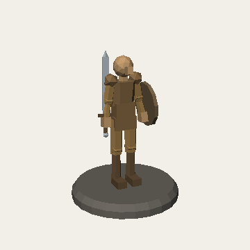
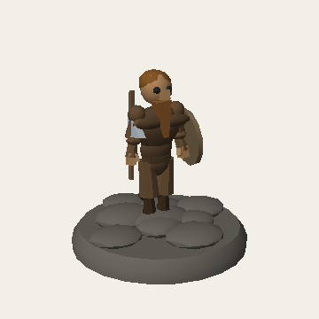
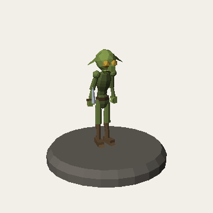
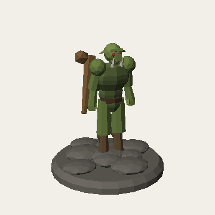
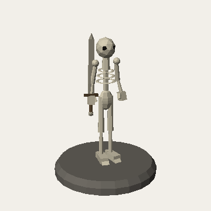
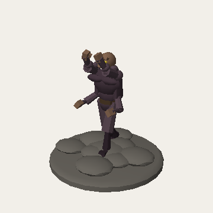
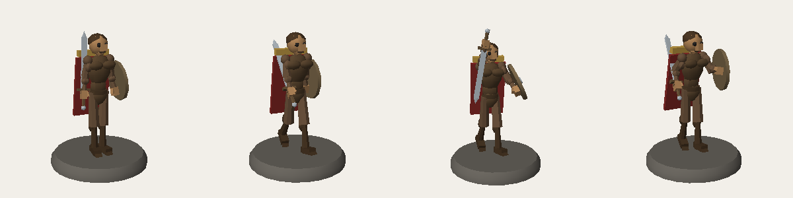
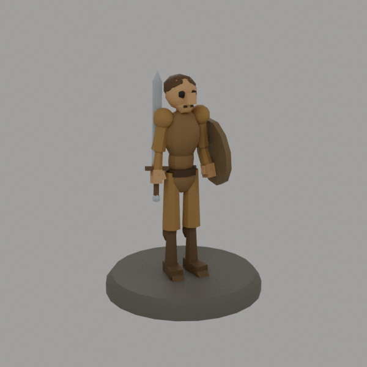

# MiniMaster

Design, rig, pose, and export **3D-printable tabletop miniatures** — a
low-poly modeling and rigging studio in pure Python. The third program in the
Forge family (alongside DiceForge and DungeonForge): where those make dice and
dungeon terrain, MiniMaster makes the minis that stand on them, working both
as a character creator and an enemy creator.

Build a figure from stretched primitive shapes, place bones and joints for
articulation, pose the skeleton, and export a watertight binary STL scaled to
tabletop size — chunky, faceted minis that look like little carvings and
print cleanly without fussy detail.

| Human Fighter | Dwarf | Goblin | Orc | Skeleton | Four-Armed |
| --- | --- | --- | --- | --- | --- |
|  |  |  |  |  |  |

One model, four of its shipped poses (idle / walk / attack / guard) — every
figure is articulated by its bones, so posing never breaks the mesh:



## Install & run

Requires Python ≥ 3.10 with tkinter (Linux: `apt install python3-tk`). The
only third-party dependency is numpy.

```bash
pip install -e .
minimaster                 # launch the studio
# or without installing:
python -m minimaster
```

## The studio

The window is a 3D viewport plus four mode tabs:

- **Model** — add primitive shapes (box, wedge, cylinder/cone, capsule,
  icosphere, torus), then stretch and place them: position / rotation /
  per-axis scale, primitive parameters (segment counts, taper, subdivisions),
  color, duplicate, and one-click **Mirror X** for symmetric limbs.
- **Rig** — build the armature: add child joints, drag their positions,
  rename, delete. Bind each shape to a bone by hand or hit **Auto-bind**
  (nearest bone wins). A joint's rotation moves everything below it.
- **Pose** — create named poses, click a joint, drag the X/Y/Z rotation
  sliders and watch the figure move in real time. Poses are stored in the
  project, so one mini can ship with idle, walk, attack, guard…
- **Export** — pick a size category (tiny 15 mm → huge 60 mm, or a custom
  height), a base (round / square / none), and a pose; check printability
  (triangle count, dimensions, watertightness, resin volume); export STL or a
  PNG turnaround.

Viewport controls: **drag** orbit · **middle/right-drag** pan · **wheel**
zoom · **click** select · **g** grab (move the selected shape in the view
plane, click to confirm, Esc to cancel) · **Ctrl+D** duplicate · **m**
mirror · **x** delete · **f** frame · **Ctrl+Z / Ctrl+Y** undo/redo.

## Part library (Spore-style)

The **Parts** tab is a snap-on part palette: pick a part, click anywhere on
the mini, and it lands on that surface point oriented outward along the
surface normal, auto-bound to the bone of the body part you clicked. Placed
parts edit as a unit — grab-move, spin about their outward axis, uniform
scale, **Mirror** for symmetric pairs (wings, horns), ungroup, delete — all
undoable.

Parts can be **posable**: a part may carry its own joint chain (the shipped
tail does), which grafts onto the character's skeleton on placement and shows
up in the Pose tab like any other joints. Removing the part removes its
joints; every pose still exports watertight.

Twelve parts ship in the box (eyes, horns, ears, claws, spikes, wings, a
posable tail, and sword/shield/axe/club/dagger), and the library is yours to
grow: model something in the Model tab (origin = attachment point, +Z =
outward), then **Save selection as part…** writes it to `~/.minimaster/parts`
with a thumbnail, ready to snap onto any future mini. Placed parts flatten
into the project, so `.mmp` files stay self-contained and shareable. See
`examples/goblin_gargoyle.mmp` for a goblin with snapped-on horns, a third
eye, mirrored wings, and a pose-curled tail.

## Starter templates

`File → New from template` (or `minimaster new <name> -o my.mmp`) opens a
fully rigged, fully posed figure to reshape instead of a blank scene:
`human_fighter`, `dwarf`, `goblin`, `orc`, `skeleton`, and a four-armed
`four_arms` horror. They come from one parameterized humanoid (21 joints) with
proportion multipliers, anatomy-informed muscle masses (see `docs/anatomy.md`),
a `feminine` build variant, and feature add-ons (beard, ears, tusks, ribcage,
cape, gear). `four_arms` uses `add_arm_pair()` to graft a lower second pair of
arms — dropped well below the primary shoulders so all four fan out cleanly —
onto the base body. Built by `tools/make_templates.py`; add your own factory
there and re-run it to grow the roster.

## Blender backend (optional)

MiniMaster's own engine is pure Python — but if a `blender` binary is on your
`PATH`, two extra commands unlock Blender's geometry and rendering power. This
is an **optional refine/output backend**: `.mmp` scenes, the studio, and the
tests stay the source of truth and never depend on Blender. Blender's bundled
Python imports the MiniMaster kernel directly, so it builds from the exact
posed meshes and colors your scene defines — no lossy STL round-trip.

```bash
# Fuse the overlapping shells into ONE watertight solid (great for printing):
minimaster fuse hero.mmp -o hero_solid.stl --method voxel --size medium
minimaster fuse hero.mmp -o hero_hard.stl  --method boolean   # hard edges kept

# High-quality Cycles render — real lighting, shadows, materials:
minimaster hq-render hero.mmp -o hero.png --smooth --samples 64
minimaster hq-render beast.mmp -o beast.png --union voxel --subdiv 1  # smooth organic
```



- **`fuse`** unions the shells into a single manifold mesh. `--method voxel`
  (default) is always watertight and auto-smooths into an organic solid;
  `--method boolean` keeps the low-poly hard edges. The result is verified
  watertight by MiniMaster's own STL reader in the test suite.
- **`hq-render`** renders with Cycles (CPU). `--union voxel --subdiv N` melts
  the primitive stack into a smooth sculpted body; `--smooth` just smooth-shades
  the facets; `--transparent` gives an alpha background.

Point `MINIMASTER_BLENDER` at a specific binary if `blender` isn't on `PATH`.
Both commands share MiniMaster's conventions (mm, size categories, poses,
bases) and print a clean error (exit 2) if Blender isn't installed — `export`
and `preview` always work without it. The in-Blender script is
`tools/blender_build.py`; the bpy-free launcher is `minimaster/blender.py`.

## Dynamic body mesh (experimental)

By default a figure exports as a **pile of independent shells** — one closed
mesh per primitive — that the slicer unions at print time. `bake` offers a
different representation: it treats every body shape as a **signed-distance
field** and fuses them into continuous **skinned solids**, so muscles blend
into a limb instead of stacking as separate lumps.

The fuse is **per anatomical part**, not one whole-body blob: the head, the
torso/pelvis ('core'), and each arm and leg are each fused into their own clean
solid (sharp edges preserved by gradient/QEF vertex placement). Limbs stay
distinct — they don't melt into the torso — while a part's own muscles fuse
smoothly *within* it; the parts overlap at the joints so the union prints as one
connected figure, and each part keeps its own color.

```bash
minimaster bake orc.mmp -o orc_body.png                       # render the fused body
minimaster bake orc.mmp -o orc_body.stl --size large --pose attack
minimaster bake orc.mmp -o smooth.stl --resolution 0.35 --blend 1.2  # smoother
minimaster bake orc.mmp -o chunky.stl --resolution 0.8              # chunkier/faster
```

`--resolution` is the voxel size (smaller = smoother, slower); `--blend` is the
smooth-union width *within* a part (higher = smoother muscle, without re-melting
limbs into the torso). Gear and face detail are kept out of the body by default
(`--all-shapes` fuses everything). PNG previews flat-shade for the chunky look
(`--smooth` for gouraud). Extraction takes a couple of seconds — a bake step,
not the live authoring view.

The extractor is a native (pure-numpy) **manifold dual-contouring** isosurface:
it emits one vertex per surface sheet in a cell, so even crossing geometry (four
arms in a tight pose) stays watertight and 2-manifold. The same kernel
(`minimaster/core/bodymesh.py`) also **smooth-skins** a baked part to the
armature (distance-weighted linear blend), so the body deforms continuously
across a joint rather than transforming as rigid shells — the foundation for
posing the mesh directly. The classic shell export (`minimaster export`) remains
available as a fallback.

## Headless CLI

Everything the Export tab does works without a display:

```bash
minimaster templates                                  # list starter templates
minimaster new orc -o my_orc.mmp                      # start from a template
minimaster export my_orc.mmp -o orc.stl --size large --pose attack
minimaster export my_orc.mmp -o orc.stl --height 40 --no-base
minimaster preview my_orc.mmp -o orc.png --azimuth 335
minimaster bake my_orc.mmp -o orc_body.stl --size large  # fuse into one skin
minimaster validate my_orc.mmp                        # watertightness gate
```

## How it prints

Every shape is an independently **watertight, outward-oriented shell**; the
exported STL is the union of overlapping shells, which every slicer merges at
slice time. Rigid per-bone binding means posing transforms whole shapes —
joints stay covered by design (limb segments overlap ball pads), so any pose
exports watertight. The `validate` command and the test suite enforce this:
every edge shared by exactly two faces, consistent winding, positive volume.

Figures are modeled at roughly 28 mm-heroic scale and rescaled on export;
size categories put the figure at 15 / 24 / 32 / 45 / 60 mm total height on a
25 mm (or custom) base.

## Project files

`.mmp` files are plain JSON: shapes (kind + params + transform + bone +
color), joints (name/parent/position), named poses (joint → XYZ euler
degrees), active pose, and base spec. They diff cleanly and are easy to
generate from scripts — the starter templates are built exactly that way.

## Architecture

```
minimaster/
  core/        geometry kernel: math3d, Mesh (+integrity checks),
               watertight primitive builders, armature FK, binary STL I/O,
               bodymesh (SDF blend -> Surface Nets isosurface + skinning)
  scene.py     the document: shapes + armature + poses + undo snapshots
  export.py    pose → scale → base → merged STL (shared by GUI, CLI, tests)
  render.py    headless z-buffer flat-shade renderer → PNG (no imaging deps)
  templates/   shipped .mmp starter scenes (regenerable)
  viewport.py  tk Canvas painter's-algorithm viewport with picking
  panels.py    Model / Rig / Pose / Export tabs
  app.py       the studio window: menus, undo, mode-aware refresh
```

## Development

```bash
pip install -e .[dev]
python -m pytest                       # 139 tests, all headless
python tools/make_templates.py         # regenerate starter templates
xvfb-run -a python tools/gui_smoke_test.py   # drive the GUI end-to-end
```

`examples/` holds a ready-to-print goblin scout (`.mmp` + STL) and an
attack-posed human fighter STL straight from the templates.
