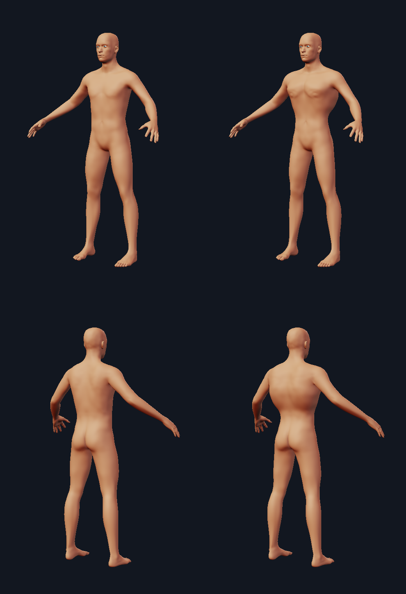

# Appendages and the body that carries them

A wing bolted onto an unchanged human back reads as a costume. In real animals
a limb and its host are one system: the limb is powered by muscles anchored on
the trunk, and those muscles reshape the trunk. `minimaster.character.creature_anatomy`
encodes that coupling as adjustments to the *existing* morph sliders, so adding
wings broadens the chest and back the way it would in an animal that flies.



*Left: a plain male base. Right: the same character after a pair of wings is
attached. Identical framing, lighting and macro settings — every difference in
the picture is the morph the appendage imposed. The back view shows the
latissimus flare and shoulder breadth; the front shows deeper pectorals over a
narrower waist and thinner thighs.*

## Why these sliders

### Wings are modified forelimbs

In both birds and bats the downstroke is driven by the **pectoralis**, anchored
on an enlarged sternum with a keel; the **supracoracoideus**, **latissimus
dorsi** and scapular muscles anchor the recovery stroke. Pectoralis major runs
roughly **8–25 % of body mass in birds** (we use the ~15.5 % mean); the ventral
thoracic flight muscles of bats average **~9.1 %**. That mass has to live
somewhere, and where it lives is the chest, back and shoulder girdle.

Flying animals also pay for it elsewhere: powered flight selects hard for low
mass, so the abdomen and hindlimbs are reduced. Hence the negative coefficients
on waist and thigh circumference, and the downward nudge on the `weight` macro.

| slider | per unit load | reading |
| --- | --- | --- |
| `torso.torso_muscle_pectoral` | +0.85 | downstroke muscle |
| `measure.measure_bust_circ` | +0.75 | ribcage/sternum housing it |
| `torso.torso_muscle_dorsi` | +0.70 | recovery stroke |
| `measure.measure_shoulder_dist` | +0.55 | girdle the wing hangs from |
| `stomach.stomach_tone` | +0.45 | lean abdomen |
| `armslegs.upperarm_shoulder_muscle` | +0.40 | deltoid/scapular |
| `neck.neck_scale_horiz` | +0.30 | trapezius load |
| `measure.measure_waist_circ` | −0.35 | mass economy |
| `measure.measure_thigh_circ` | −0.30 | reduced hindlimb |

### A tail continues the spine

Caudal vertebrae begin immediately after the sacrum, so a heavy tail needs a
broad sacrum and pelvis and strong caudal/gluteal musculature — the same package
bipedal hoppers and theropods use to make a tail work as a counterbalance. So a
tail widens the hips (`hip.hip_scale_horiz`, `hip.hip_scale_depth`,
`measure.measure_hips_circ`) and fills the glutes (`buttocks.buttocks_volume`).

### Horns are bone, not decoration

A horn is a **cornual process of the frontal bone** under a permanent keratin
sheath — unlike antlers it is never shed. Carrying one loads the neck, and the
load shows up as neck girth (`neck.neck_scale_horiz`, `neck.neck_scale_depth`)
and a heavier brow where it grows from (`forehead.forehead_nubian`,
`forehead.forehead_temple`).

### An extra arm pair needs a second girdle

Same reasoning as the primary pair: broader shoulders, thicker traps and lats to
hang it from.

## Load: size actually matters

Coefficients are written for the **typical installation** of each kind, which is
why `PAIRED_KINDS` exists. Wings, horns and harvested arms normally come in
pairs, so a *pair* scores load 1.0 and a lone one scores less. Tails are
normally solitary, so mirroring one costs *more*. Getting this backwards
saturates every chest slider on a default pair and makes a 20 m wingspan look
identical to a 9 m one.

Load then scales with the appendage's own size (`span` for wings, `length` for
tails and horns) and its `scale`, so a small decorative horn costs almost
nothing.

```python
from minimaster.character import appendages as A, creature_anatomy as ca

wings = A.Appendage("wing", anchor_point=(0.84, 4.39, -0.73), mirror=True,
                    up_hint=(1.0, 0.85, 0.0), params=dict(span=13.0))
notes = ca.apply_to(character, [wings], catalog)
```

`apply_to` **adds to** existing slider values rather than replacing them, so a
deliberate setting is never silently overwritten, and clamps the result to each
slider's range. Unknown keys are dropped when a catalog is supplied, so a
character built against a different asset set still loads.

## The honest physics

`flight_report()` refuses to pretend. It takes the body volume straight from the
character's own mesh (a MakeHuman unit is a decimetre, so volume in units³ is
already litres) and the wingspan from the *built* wing geometry rather than the
`span` parameter, since wings are swept and drooped.

```
body mass      ~69.9 kg (from mesh volume)
wingspan       1.46 m
flight muscle  ~10.8 kg needed (16% of mass, avian mean)
wing loading   ~196 kg/m2 (flying birds sit at 1-20)
verdict        fantasy flight: no real anatomy supports this
note           powered flight tops out around 2.2 kg in bats
note           even soaring scales out at ~41 kg and ~5.1 m span
note           this body is 1.7x the soaring mass limit
```

Reference limits: powered flight tops out around **1.1–2.2 kg** in bats (the
required wingbeat frequency overtakes what is attainable), and even soaring
scales out at roughly **41 kg / 5.1 m span** from albatross and extinct-petrel
data. A human-scale flyer is not marginal, it is off the chart by ~1.7×, and the
report says so. The numbers are there to inform the design, not to block it —
nothing in the module prevents building the character anyway.

## Regenerating the figure

```
PYTHONPATH=. python tools/anatomy_demo.py
```
