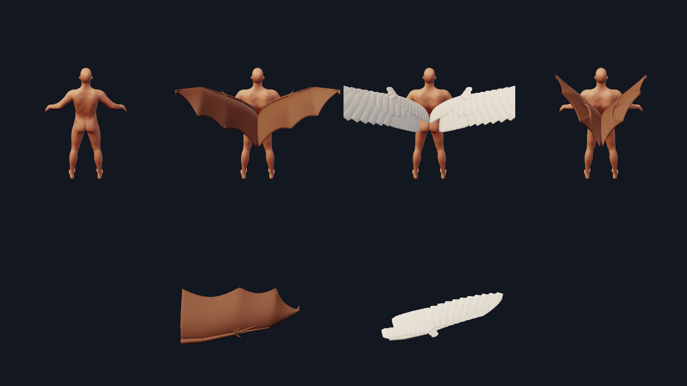

# Wings

A wing is not a shape. In both bats and birds it is a **modified forelimb** —
humerus, radius/ulna, wrist, and then an enormously elongated hand that carries
the flight surface. Everything a viewer reads as "wing" comes from that
skeleton: the elbow crook, the finger struts fanning through a membrane, the
scalloped free edge, the shingled feathers. So `minimaster.character.wings`
builds the skeleton first and hangs the surface on it.



*Top: a plain body, then membrane wings, feathered wings, and the same membrane
wings folded. Bottom: each planform seen from above.*

```python
from minimaster.character import appendages as A

wings = A.Appendage("wing", anchor_point=(0.84, 4.39, -0.73), mirror=True,
                    up_hint=(1.0, 1.5, 0.0),
                    params=dict(style="membrane", span=13.0, fold=0.0))
shells = wings.build(base, verts)     # [("wing_l", Mesh), ("wing_r", Mesh)]
```

## The shared arm

`WingSkeleton` places shoulder, elbow, wrist, thumb and digits II–V in the flat
wing plane. Bone lengths are quoted **relative to the forearm**, the standard
measure in chiropteran morphometrics. Digits II–V are the ones that support the
membrane; their metacarpals and phalanges are the elongated elements, and those
proportions have been conserved for roughly 50 million years.

The load-bearing detail is that **digit III effectively continues the forearm**.
That is what gives a wing its span. Fan the digits wide off an already-swept
forearm and the angles compound: the hand becomes a backward-pointing paddle,
the whole chain's length goes into chord, and the planform comes out square.
The first build did exactly that — digit III ended up 62° off the span axis and
the "wing" had an aspect ratio of 1.1. There is a regression test for it.

`fold` closes the wing the way a real one folds: the forearm swings back against
the humerus about the elbow, and the hand swings back against the forearm about
the wrist. `span` always describes the wing **spread** — measuring reach after
folding would rescale a folded wing back up to the requested span, so folding
would change the pose but never make the wing smaller.

## Membrane (bat / dragon)

The patagium is stretched over the skeleton. Real bats divide it into named
regions, and the outline follows them:

| region | runs from | to |
| --- | --- | --- |
| **propatagium** | shoulder | wrist (the leading edge) |
| **dactylopatagium** | digit II | digit V (between the fingers) |
| **plagiopatagium** | the body flank | digit V (the inner wing) |

Digit I — the thumb — stays free and clawed at the wrist. It is the single most
recognisable bat/dragon detail and costs one extra tube.

The membrane carries **~12% camber**, the value measured on real bat armwings
(11.8–13.1% of chord), peaking near quarter chord. Between the digit tips the
free edge sags into a smooth arc whose depth is proportional to the gap. Bowing
only the midpoint leaves a V-notch and the wing reads as torn; the tips stay
sharp because they are finger ends, but the sag between them has to be an arc,
which is what a stretched membrane actually forms.

Bones are laid **on** the membrane surface, so they read as ridges under the
skin. The membrane is a parametric sweep, so a bone drawn in the flat plan has
no closed-form surface height; a Gaussian-weighted lookup over the surrounding
grid is smooth, needs no solver, and is exact wherever a bone lies on a grid
line.

## Feathered (bird / angel)

Primaries root along the hand, secondaries along the forearm, two rows of
coverts shingle over their bases, and an alula sits on the thumb. Most birds
carry 9–10 primaries; the default is 10 primaries and 12 secondaries.

Each feather is an asymmetric blade — a narrow leading vane and a wide trailing
one, the asymmetry that makes a flight feather aerodynamic rather than
decorative, and which is visible in silhouette.

The vane runs **nearly parallel-sided** before rounding off at the tip. A vane
shaped like `sin(pi*t)` is widest only at its middle, so neighbours touch at a
single point and leave V-shaped gaps; the first build looked like a stegosaur's
back for exactly that reason. Feather width is set well above the root spacing
so consecutive feathers overlap the way real ones shingle.

## Output contract

Every piece — membrane, each bone, each feather — is its own **closed solid**,
all merged into one mesh. Merged overlapping closed shells still use every edge
exactly twice, so the mesh passes the watertight gate as-is and the slicer
unions the parts at slice time. That is why bones can sit *inside* the membrane
and feathers can interpenetrate with no boolean work anywhere.

## Placement

Appendages are authored at the origin, and the wing's local frame is:

```
+X  spanwise, shoulder -> wingtip
+Y  down (the underside); camber bulges toward -Y
+Z  chordwise, leading edge -> trailing edge
```

`Appendage.up_hint` aims the anchor's tangent, which is where local +X ends up.
A lateral hint puts the span across the character's back, the chord trailing
behind, and the thickness vertical — which is what a wing does. Without it a
back-mounted wing sweeps off in whatever direction the nearest body triangle
happens to face.

A mirrored pair is an exact mirror image, which took two fixes:

1. The mirrored anchor already carries a mirrored tangent, and reflecting the
   tangent flips the handedness of the frame's bitangent (`n' × t' = −M(n × t)`).
   Negating local X on top of that cancels into a **180° roll**, not a mirror.
   Negating local Y is what leaves a true mirror.
2. The anchor binds to the **whole face**, not `face[:3]`. The body cage is
   quads, and a quad and its mirror image are stored with different corner
   orders, so taking the first three corners picks a different sub-triangle on
   each side. Newell's normal over every corner depends only on cyclic order,
   so mirror-image faces give exactly mirror-image normals.

Together those take the mirror error from ~1.5 units to exactly 0.

## Printability

`thickness` is in wing units. A 32 mm figure makes one unit ≈ 1.9 mm, so the
0.30 default membrane is ≈ 0.57 mm — thin, but above the ~0.3 mm a resin printer
resolves. Feathers default to 0.20 (≈ 0.38 mm). Scaling the whole appendage down
scales these too, so a half-size wing needs its thickness raised.

## Regenerating the figure

```
PYTHONPATH=. python tools/wing_demo.py
```
